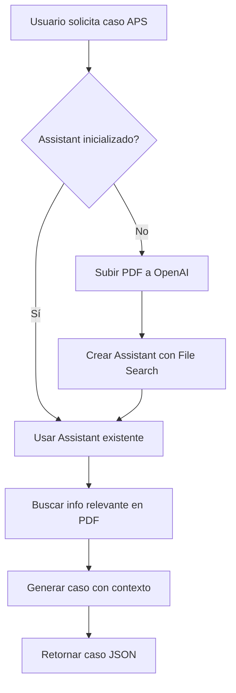

# Sistema RAG con Assistants API de OpenAI

## 📋 Descripción

Este sistema utiliza la **Assistants API de OpenAI** con **File Search** para implementar RAG (Retrieval-Augmented Generation) en la generación de casos clínicos de APS (Atención Primaria de Salud).

**Enfoque principal**: Los casos de APS no solo evalúan diagnóstico, sino especialmente el **MANEJO CORRECTO** del paciente en CESFAM, incluyendo:
- ✅ Decisiones de derivación (cuándo, dónde, cómo)
- ✅ Identificación de red flags que requieren derivación urgente
- ✅ Manejo inicial apropiado en CESFAM antes de derivar
- ✅ Seguimiento ambulatorio vs derivación a especialista

## 🎯 ¿Cómo funciona?

1. **Una sola vez**: El PDF se sube a OpenAI y se crea un Assistant con capacidad de búsqueda
2. **En cada solicitud APS**: El sistema busca automáticamente información relevante del PDF
3. **Otras especialidades**: Usan el método tradicional sin RAG

## 🚀 Uso

### 1. Inicializar el Assistant (PRIMERA VEZ)

Puedes inicializar el Assistant de dos formas:

**Opción A: Hacer una llamada POST al endpoint**
```bash
curl -X POST http://localhost:3000/api/init-assistant
```

**Opción B: El sistema se inicializa automáticamente** al generar el primer caso APS

### 2. Verificar estado del Assistant

```bash
curl http://localhost:3000/api/init-assistant
```

Respuesta esperada:
```json
{
  "assistantId": "asst_xxxxx",
  "initialized": true
}
```

### 3. Generar caso clínico con RAG

```bash
curl -X POST http://localhost:3000/api/generar-caso \
  -H "Content-Type: application/json" \
  -d '{
    "especialidad": "aps",
    "nivel_dificultad": "medio"
  }'
```

## 📁 Estructura de archivos

```
data/
└── medical-knowledge/
    └── Capítulo-3-Web.pdf    ← Tu PDF con guías de APS
```

## 🔑 Especialidades disponibles

- `medicina_interna`
- `urgencia`
- `respiratorio`
- `digestivo`
- `aps` ← **Usa RAG automáticamente**
- `otro`

## ⚙️ Configuración técnica

### Archivos modificados:

1. **`lib/assistant.ts`**: Lógica del Assistant con File Search
2. **`types/case.ts`**: Añadido tipo `"aps"` a especialidades
3. **`lib/prompts.ts`**: Actualizado para incluir instrucciones APS
4. **`app/api/generar-caso/route.ts`**: Detecta APS y usa RAG
5. **`app/api/init-assistant/route.ts`**: Endpoint de inicialización

### Variables de entorno necesarias:

```env
OPENAI_API_KEY=sk-...
```

## 🔄 Flujo de ejecución



## 💡 Ventajas de este enfoque

✅ **PDF se sube una sola vez** (ahorro de costos y tiempo)
✅ **OpenAI maneja el RAG automáticamente** (chunking, embeddings, búsqueda)
✅ **Activación condicional** (solo para casos APS)
✅ **Escalable** (fácil añadir más PDFs o especialidades)
✅ **Sin base de datos extra** (OpenAI gestiona los vectores)

## 🧪 Testing

### Probar caso sin RAG (urgencia)
```bash
curl -X POST http://localhost:3000/api/generar-caso \
  -H "Content-Type: application/json" \
  -d '{"especialidad": "urgencia", "nivel_dificultad": "medio"}'
```

### Probar caso con RAG (APS)
```bash
curl -X POST http://localhost:3000/api/generar-caso \
  -H "Content-Type: application/json" \
  -d '{"especialidad": "aps", "nivel_dificultad": "medio"}'
```

## 📝 Notas importantes

- El Assistant se crea **una sola vez** y se reutiliza
- Si reinicias el servidor, el `ASSISTANT_ID` se pierde de memoria pero el Assistant sigue existiendo en OpenAI
- Para persistir el ID entre reinicios, considera guardarlo en una variable de entorno o base de datos
- El modelo usado es **GPT-4o** (requerido para File Search)

## 🔮 Mejoras futuras

- [ ] Persistir `ASSISTANT_ID` en base de datos
- [ ] Añadir más PDFs para otras especialidades
- [ ] Implementar caché de respuestas frecuentes
- [ ] Dashboard para gestionar documentos
- [ ] Métricas de uso del RAG
